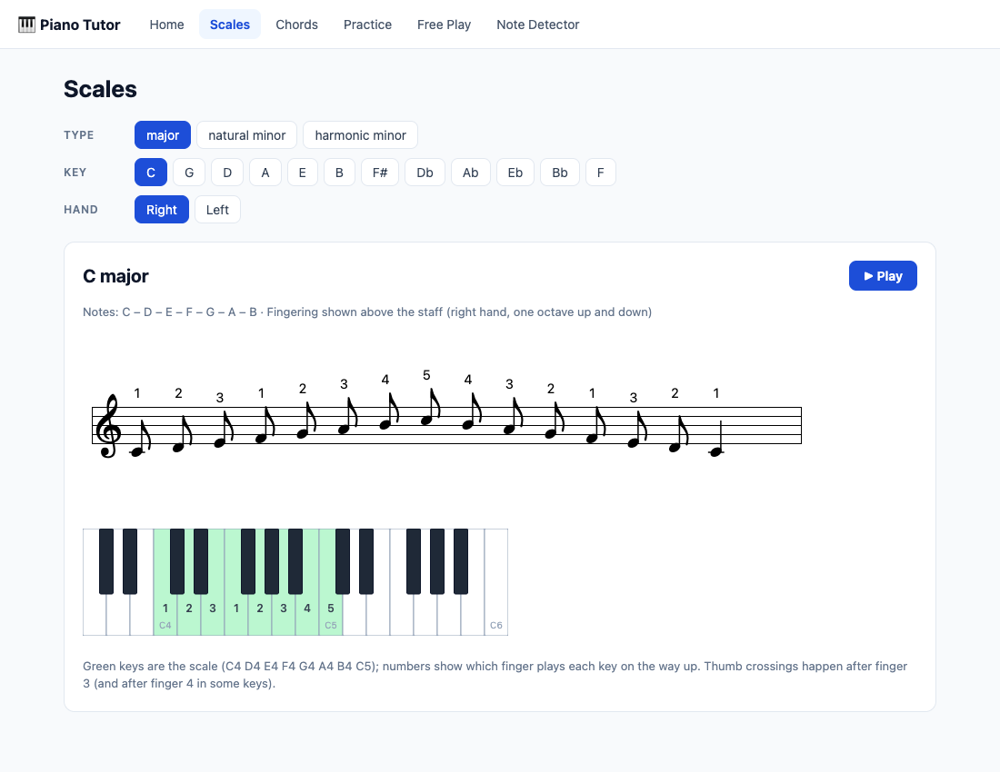
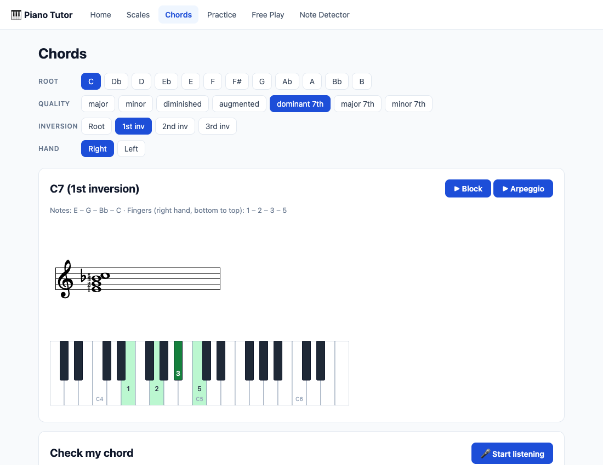
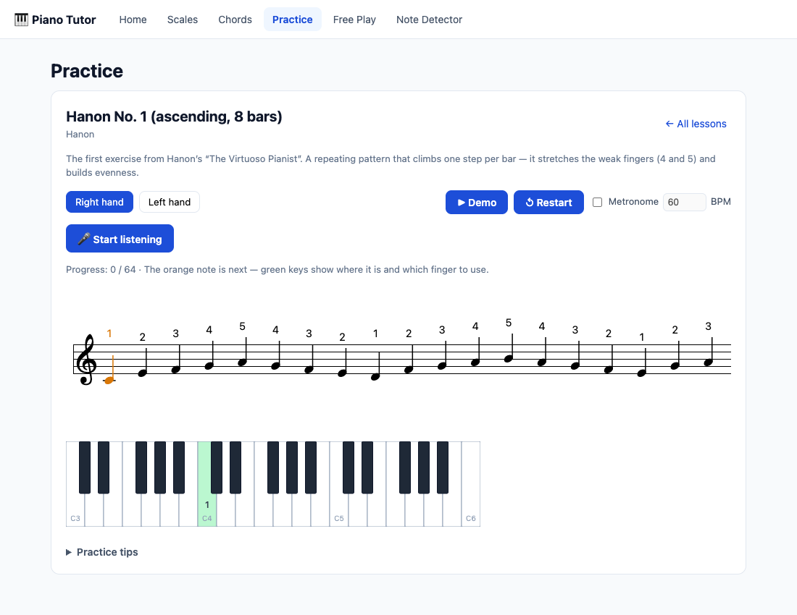

# 🎹 Piano Tutor

A piano practice companion that runs in your browser. Plug in a **MIDI keyboard** for instant,
polyphonic-accurate feedback, or use no gear at all and let it **listen through the
microphone**. Built for beginner-to-intermediate players on any piano.

Play a note and watch it light up on the on-screen keyboard. Play a scale and the app follows
you note by note, checking your fingering. Play a chord and it tells you what you played — and
what you missed.



**New to the piano, or unsure what to practice next?** Start with the
[Learning Guide](docs/GUIDE.md) — a staged path from first notes to early intermediate
(~ABRSM Grade 4) that organizes everything below into a curriculum, with weekly practice
plans and curated external resources. The same guide lives in the app under **Guide**.

## Features

### 📚 Reference library

- **56 scales** — major, natural minor, and harmonic minor in every key, plus blues, dorian,
  mixolydian, and major pentatonic — with sheet music, correct key signatures, and standard
  fingering (ABRSM/Hanon convention) for each hand, shown on both the staff and the keyboard.
- **Every common chord** — major, minor, diminished, augmented triads; dominant/major/minor
  7ths, half-diminished, diminished 7th, and major 6th — in all 12 roots and every inversion,
  with notation and fingering, plus jazz **shell voicings** (root+3rd / root+7th).
- Everything is **playable**: hear any scale or chord on a sampled grand piano (block or
  arpeggiated).

### 🎹 Input: MIDI or microphone

- **Web MIDI** (Chromium browsers): connect a keyboard and every mode grades your playing
  instantly and polyphonically — the app prefers MIDI automatically whenever a device is
  connected. The mic remains the universal fallback.
- **Instant note detection** for melodies and scales — keys light up as you play, and the Note
  Detector screen doubles as a tuner (note name, frequency, cents offset).
- **Chord detection** via [Spotify's Basic Pitch](https://github.com/spotify/basic-pitch)
  neural network, running entirely in your browser (no audio ever leaves your machine). About a
  second behind real time — perfect for "did I play that chord right?".
- **Check my chord**: pick any chord in the library, play it, and get told exactly which chord
  tones were missing or extra.



### ✍️ Transcription

- **Free Play** writes everything you play onto a staff as you play it, and names the chords it
  recognizes.
- **Record with metronome**: one bar of count-in, play in time, and your playing is quantized
  into real notation — quarter and eighth notes, rests, and barlines.

### 🏋️ Guided practice

Classic beginner methods with live feedback — the next note is highlighted, the target key and
finger are shown in green, wrong notes flash red but the lesson patiently waits ("wait, don't
fail"):

- **Five-finger positions** in C, G, and F
- **Hanon No. 1** (the famous finger-independence exercise, first 8 bars)
- **Scale routine** in all 24 keys — one and two octaves, hands separate and **hands together
  on a grand staff**
- **Arpeggios and broken chords** with standard fingerings
- **I–IV–V–I cadence drills** — chord progressions with hand-friendly voicings (uses chord
  detection)
- **Leveled sight-reading** — five difficulty levels from C-position quarters to grand-staff
  hands-together, with a clean-streak level-up system; new melody every time
- **Jazz & blues** — blues scales, ii–V–I guide-tone drills with smooth voice-leading, and
  12-bar blues comping with shell voicings

### 👂 Ear training

Interval recognition, chord-quality quizzes (10 qualities by level 4), and **call-and-response**:
the app plays a short phrase, you play it back from memory.

### 🥁 Rhythm trainer

Tap rhythms on any key against the metronome — four leveled pattern sets from steady quarters
to **swing eighths, the Charleston, and jazz comping** — with per-note timing feedback
(perfect ±40 ms, good ±100 ms, early/late) painted onto the score.

### 🎼 Songs (graded repertoire)

Real pieces rendered on a multi-system grand staff in **wait-mode**: the score waits for the
right note, section by section, hands separate or together. Ships with a graded starter set
(Ode to Joy, Minuet in G, a swung When the Saints, a 12-bar blues with shells, and more) and
**imports your own MusicXML or MIDI files**.

Completed segments are saved to a local practice history on the Home screen.



## Getting started

```bash
npm install
npm run dev        # → http://localhost:5173
```

Then:

1. Allow **microphone access** when prompted (audio is processed locally, never uploaded).
2. Put your phone/laptop mic reasonably close to the piano.
3. Start with **Practice → Five-finger position in C**.

Playback uses piano samples fetched from the network on first use; everything else works
offline once loaded.

### Tips for good detection

- Play **one note at a time** in melody mode; switch to **Chords** mode (Free Play) or chord
  lessons for polyphonic playing.
- **No sustain pedal** during lessons — overlapping decays smear detection.
- If detection seems off, open **Note Detector** and play single notes to see exactly what the
  app hears.

## Commands

| Command         | What it does                                  |
| --------------- | --------------------------------------------- |
| `npm run dev`   | Dev server with hot reload                    |
| `npm test`      | Unit tests (theory, fingering, detection, quantization) |
| `npm run check` | Type checking (svelte-check + tsc)            |
| `npm run build` | Production build to `dist/` — deployable to any static host |

## How it works

| Concern          | Approach |
| ---------------- | -------- |
| Melody detection | [pitchy](https://github.com/ianprime0509/pitchy) (McLeod pitch method) polled from the mic ~60×/s, with clarity thresholds and hysteresis to suppress octave flicker from piano harmonics |
| Chord detection  | Basic Pitch CNN on TensorFlow.js (WASM backend) in a Web Worker — sliding 2 s window every 0.5 s over a ring buffer, with de-duplication and harmonic-ghost filtering |
| Sheet music      | [VexFlow](https://vexflow.com/) — scores built programmatically with fingering annotations, rests, barlines, and live per-note highlighting |
| Music theory     | [tonal](https://github.com/tonaljs/tonal) computes all scale/chord spellings; fingerings are hand-authored data (they're pedagogy, not math) |
| Playback         | [Tone.js](https://tonejs.github.io/) sampler with Salamander grand piano samples |

The mic is opened with browser voice-processing (echo cancellation, noise suppression, auto
gain) **disabled** — those filters are built for speech and destroy piano transients.

Detection logic is pure TypeScript with no browser dependencies, so the test suite runs
synthesized piano tones through the exact same code path the microphone feeds — the C major
scale test literally plays a scale into the detector and asserts every note.

## Browser support

Any evergreen browser. Safari note: audio can only start from a click, so everything is gated
behind the "Start listening" button. No special server headers are required — the build is
plain static files.

## Roadmap ideas

- More graded repertoire (grades 3–4: Burgmüller, Clementi, Bach Prelude in C, Joplin) via a
  MusicXML → JSON build pipeline (`src/lib/songs/musicxml.ts` already parses; wire it to a
  `scripts/convert-songs.ts` over `content/musicxml/`)
- MusicXML export of transcriptions
- A4 calibration and adjustable detection thresholds
- Timed song mode (grade timing against the metronome, not just pitches)
- Lead-sheet comping practice (chord symbols graded as poly chords)
